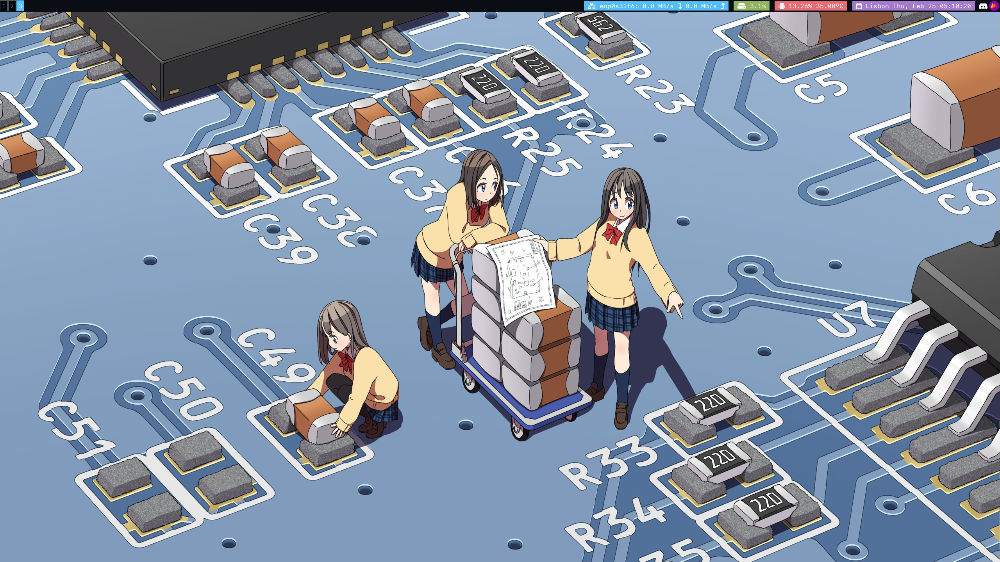
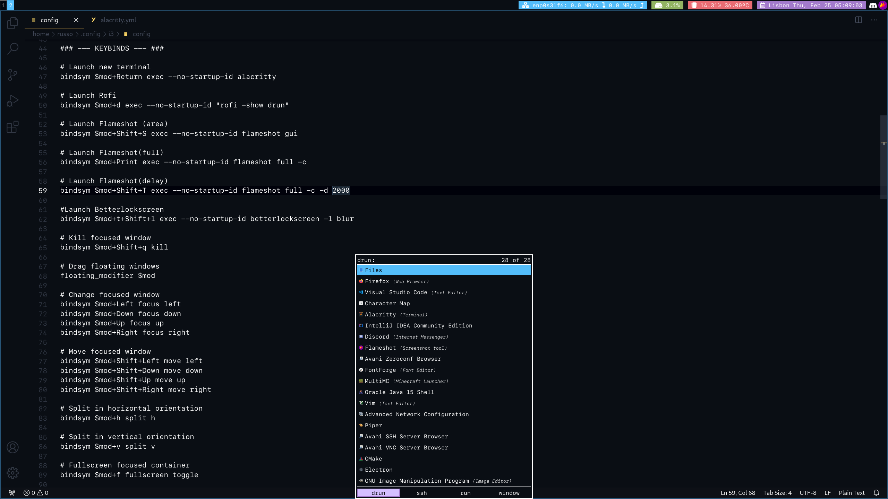

# Old Arch Linux Configuration Files v1

This repository contains some of my old arch linux configuration files and below is a list of some of the packages I usually install / use.

 

| **Category**              | **Name**           | **About**                                          |
|:--------------------------|:-------------------|:---------------------------------------------------|
|**Shell**                  |Bash                |https://www.gnu.org/software/bash                   |
|**Terminal Emulator**      |Alacritty           |https://github.com/alacritty/alacritty              |
|**Text Editor**            |Nano                |https://www.nano-editor.org                         |
|**Code Editor**            |Visual Studio Code  |https://code.visualstudio.com                       |
|**Display Server**         |Xorg-Server         |https://wiki.archlinux.org/title/xorg               |
|**WM Starter**             |Xorg-Xinit          |https://wiki.archlinux.org/title/Xinit              |
|**Window Manager**         |i3-gaps             |https://github.com/Airblader/i3                     |
|**Session Lock**           |Betterlockscreen    |https://github.com/pavanjadhaw/betterlockscreen     |
|**Authorization Manager**  |Polkit              |https://wiki.archlinux.org/title/Polkit             |
|**Authentication Agent**   |Polkit Gnome        |https://wiki.archlinux.org/title/Polkit             |
|**App Launcher**           |Rofi                |https://github.com/davatorium/rofi                  |
|**Status Bar**             |Polybar             |https://github.com/polybar/polybar                  |
|**Network Manager**        |NetworkManager      |https://wiki.gnome.org/Projects/NetworkManager      |
|**Sound Server**           |PulseAudio          |https://www.freedesktop.org/wiki/Software/PulseAudio|
|**Volume Controller**      |Pacmixer            |https://github.com/KenjiTakahashi/pacmixer          |
|**Screen Recorder**        |SimpleScreenRecorder|https://www.maartenbaert.be/simplescreenrecorder    |
|**File Explorer**          |Nautilus            |https://wiki.archlinux.org/title/GNOME/Files        |
|**Document Viewer**        |Zathura             |https://pwmt.org/projects/zathura                   |
|**PDF Support**            |Zathura Poppler     |https://pwmt.org/projects/zathura-pdf-poppler       |
|**Screenshot Software**    |Flameshot           |https://github.com/flameshot-org/flameshot          |
|**Image Editor**           |GIMP                |https://www.gimp.org                                |
|**Wallpaper Setter**       |Feh                 |https://feh.finalrewind.org                         |
|**Disk Management Service**|Udiskies2           |https://www.freedesktop.org/wiki/Software/udisks    |
|**Disk Automounter**       |Udiskie             |https://github.com/coldfix/udiskie                  |
|**AUR Helper**             |Paru                |https://github.com/Morganamilo/paru                 |
|**Coding Font**            |Fira Code           |https://github.com/tonsky/FiraCode                  |
|                           |SFMono              |https://www.google.com/get/noto                     |
|**Other Fonts**            |Font Awesome        |https://fontawesome.com                             |
|                           |Noto Fonts          |https://www.google.com/get/noto                     |
